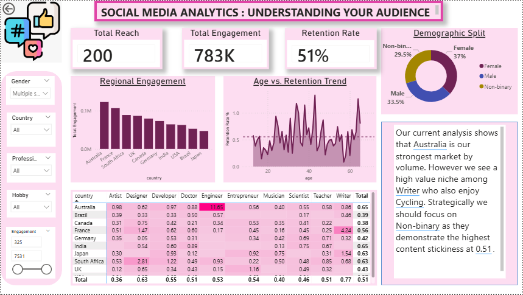

# Social Media Audience Intelligence Dashboard

## Project Overview

### Business Problem
In an era of content saturation, social media marketers struggle to identify **which audience segments drive real engagement versus passive reach**. Generic broadcasting wastes budget and misses high-value niches. Decision makers need a single source of truth that translates raw social signals into targeted, actionable strategy.

### Objective
Build an  interactive analytics dashboard that segments a social media audience by **demographics, geography, profession and hobby**, uncovers engagement and retention patterns and surfaces the highest value niches — enabling data driven content and ad targeting decisions.

### Dataset Summary
| Property | Detail |
|---|---|
| **Source** | Synthetic social media user dataset |
| **Records** | 200 users |
| **Geography** | 10 countries (Australia, Brazil, Canada, France, Germany, India, Japan, South Africa, UK, USA) |
| **Demographics** | 3 gender identities · Ages 13–65 · 10 professions · 10 hobby categories |
| **Engagement Signals** | Likes, Comments, Shares, 3-second Video Views, 1-minute Video Views |

### Expected Business Value
- Reduce wasted ad spend by targeting high retention segments
- Identify untapped niche audiences with disproportionate engagement
- Inform content calendar decisions with regional and demographic data
- Benchmark cross country performance to prioritise market investment

---

## Key Business Questions Answered

1. Which country drives the **highest total social media engagement**?
2. Which **profession × country** combination delivers the strongest content stickiness?
3. How does **age correlate with retention rate** across the audience?
4. Which **gender demographic** shows the highest content stickiness score?
5. What is the overall **audience retention rate**, and how does it vary by filter?
6. Which **hobby segment** amplifies the value of professional niches?
7. Where should the brand focus its **geographic ad budget** for maximum ROI?
8. Which audience segment should be prioritised for **long-form video content**?

---

## Data Overview

### Schema
| Column | Type | Description |
|---|---|---|
| `user_id` | String | Unique user identifier (U001–U200) |
| `country` | String | User's country of residence |
| `gender` | String | Male / Female / Non-binary |
| `age` | Integer | Age in years (13–65) |
| `likes` | Integer | Total likes received |
| `comments` | Integer | Total comments received |
| `shares` | Integer | Total content shares |
| `profession` | String | User's professional role |
| `hobby` | String | Primary hobby / interest |
| `3-second-video-views` | Integer | Short-form video view count |
| `1-minute-video-views` | Integer | Long-form video view count |

### Data Quality Observations
- No null or missing values detected across all 200 records
- No duplicate `user_id` entries
- All numeric columns contain valid, non-negative integers
- Age range spans 13–65, including minors important for content compliance filters
- Dataset is balanced across genders: Female ~37%, Male ~33.5%, Non-binary ~29.5%
- Professions and hobbies are evenly distributed with ~10 categories each

---

## Tools & Technologies Used

| Tool | Purpose |
|---|---|
| **Power BI Desktop** | Dashboard development, visual design, and publishing |
| **Power Query ** | Data ingestion, cleaning and transformation |
| **DAX (Data Analysis Expressions)** | Custom KPI measures and calculated columns |
| **CSV** | Source data format and initial data inspection |

---

## Data Cleaning & Preparation

All data preparation was performed inside **Power Query** within Power BI Desktop.

### Steps Performed

**1. Data Import & Type Validation**
- Imported `social_media_analysis.csv` via Power Query's Text/CSV connector
- Verified and enforced correct data types: integers for all engagement columns, text for categorical fields

**2. Column Renaming & Standardisation**

**3. Missing Value Check**

**4. Duplicate Removal**
- Applied `Remove Duplicates` on `user_id` — confirmed all 200 rows are unique

**5. Feature Engineering — Total Engagement**
- Created a calculated column combining all interaction signals:
  ```
  Total_Engagement = likes + comments + shares
  ```


## Measures / KPIs Created

> All measures were built using **DAX** in Power BI.

| Measure | DAX Logic Summary | Business Insight |
|---|---|---|
| **Total Reach** | `COUNTROWS(social_media_analysis)` | Tracks the total number of unique users in the current filter context — headline audience size metric |
| **Total Engagement** | `SUM(likes) + SUM(comments) + SUM(shares) + SUM(Short_Video_Views) + SUM(Long_Video_Views)` | Aggregates all five interaction signals into one volume KPI — 783K baseline |
| **Retention Rate %** | `DIVIDE(SUM(Long_Video_Views), SUM(Short_Video_Views))` | Measures what fraction of 3-second video viewers watch for a full minute — a proxy for content quality and audience fit |
| **Eng. Per User** | `DIVIDE([Total Engagement], [Total Reach])` | Normalises engagement by audience size to compare segments of different scales fairly |
| **Weighted Score** | `([Retention Rate %] * 0.5) + (DIVIDE([Eng. Per User], MAXX(ALL(Table), [Eng. Per User])) * 0.5)` | Composite score blending retention depth with engagement intensity — used for heatmap heat-coding and ranking |

---

## Analysis Performed

### 1. Regional Engagement Analysis
A bar chart ranking the 10 countries by total engagement volume identified **Australia** as the dominant market, followed by France and South Africa. This baseline informs budget allocation priorities.

### 2. Age vs. Retention Trend
A line chart plotted `Retention Rate %` against individual `age` values, overlaid with a target-line reference. The trend reveals a **non-linear retention pattern**, with spikes in the 30–45 age band and again at 60+, suggesting mid-career professionals and seniors consume long-form content more deeply.

### 3. Demographic Split (Gender Analysis)
A donut chart decomposed the audience into Female (37%), Male (33.5%), and Non-binary (29.5%). When weighted by retention score, the **Non-binary segment outperforms**, scoring the highest content stickiness at **0.51**.

### 4. Profession × Country Heatmap
A matrix visual with conditional colour formatting cross-tabulated 10 professions against 10 countries. The Weighted Score was used as the value, surfacing standout cells:
- **Australia × Engineer** (1.65 — highlighted in dark pink as the maximum cell)
- **France × Engineer** (4.24 — secondary peak, high retention)
- **Writers** as a cross-country high-value professional segment

### 5. Niche Intersection Analysis
By applying the **Hobby slicer** to the profession heatmap, the analysis identified that **Writers who also enjoy Cycling** represent a narrow but disproportionately high-value niche — appearing in the strategic insights callout box on the dashboard itself.

### 6. Engagement Slider Filtering
A dynamic min-max engagement range slider allowed drill-down into the top-engagement quartile, confirming that the highest-engaging users cluster in Australia, France, and South Africa.

---

## Dashboard Features

### 🎛️ Filters & Slicers
| Slicer | Type | Function |
|---|---|---|
| **Gender** | Multi-select dropdown | Filter all visuals by one or more gender identities |
| **Country** | Dropdown | Isolate a single market or compare selected countries |
| **Profession** | Dropdown | Drill into a specific professional audience segment |
| **Hobby** | Dropdown | Identify hobby-based niche audiences |
| **Engagement Range** | Double-ended slider | Dynamically filter users by total engagement band (325–7531 range shown) |

### Visualisations Used
- **KPI Cards** — Total Reach, Total Engagement, Retention Rate % (headline metrics)
- **Donut Chart** — Demographic split by gender
- **Clustered Bar Chart** — Regional engagement by country (sorted descending)
- **Line Chart** — Age vs. Retention Rate scatter/trend
- **Matrix Heatmap** — Country × Profession with conditional colour formatting
- **Text Insight Box** — Auto-narrative callout summarising top findings

### Interactive Elements
- All slicers perform **cross-filtering** across every visual simultaneously
- Heatmap cells support **hover tooltips** showing exact Weighted Score values
- Bar chart bars are **click-selectable** for country-level drill-through
- KPI cards update **dynamically** with every slicer change

### Drill-Down Capabilities
- Selecting a country in the bar chart filters the heatmap to that country's profession breakdown
- Adjusting the Engagement slider narrows both charts and the KPI cards in real time
- Combining Profession + Hobby slicers enables **niche intersection analysis**

---

## Key Insights

1. 🇦🇺 **Australia is the #1 market by engagement volume** — it should receive the largest share of content investment and paid amplification budget.

2. **Writers who enjoy Cycling are a high-value niche** — despite being a small segment, they show above-average retention, making them ideal for premium content or brand partnerships.

3. **Non-binary users lead in content stickiness (0.51)** — this segment watches the most long-form video relative to short-form exposure, signalling strong content-to-audience fit.

4. **Female users form the largest gender segment (37%)** — but Non-binary users deliver higher per-capita retention, suggesting a quality-over-quantity opportunity.

5. **Australia × Engineer is the single highest-performing cell (1.65 Weighted Score)** — Engineering professionals in Australia are a prime target for B2B and professional development content.

6. **France shows outsized Engineer retention (4.24)** — a second, distinct market for engineering-oriented campaigns beyond Australia.

7. **Retention is non-linear across age** — the 30–45 cohort and the 60+ cohort exhibit the deepest video retention, suggesting long-form content should be targeted at mid-career and senior professionals rather than younger audiences.

8. **Total engagement of 783K across just 200 users averages ~3,915 per user** — a strong baseline indicating high-affinity audience, not a passive follower base.

9. **Profession matters more than geography for retention** — Writers and Engineers consistently appear in top-performing cells regardless of country.

10. **Hobby × Profession intersections reveal the richest niches** — single-dimension targeting (country or profession alone) misses high-value clusters only visible through combined filters.

11. **Brazil, Japan, and India underperform in engagement volume** — these markets may require localised content strategies or different platform tactics before scaling spend.

12. **The 51% average Retention Rate** is a healthy benchmark but masks segment-level variance — Non-binary Writers on Cycling content likely far exceed this, while some country-profession combinations fall well below.

---

## 📋 Business Recommendations

| Priority | Recommendation | Supporting Evidence |
|---|---|---|
| High | **Double down on Australia** — increase content frequency, sponsored posts, and influencer partnerships in this market | Highest engagement bar in Regional chart |
| High | **Create a Writer × Cycling content series** — niche but deeply engaged; ideal for a sponsored editorial or newsletter product | Dashboard insight callout + hobby filter analysis |
| Medium | **Launch Non-binary inclusive campaigns** — this segment's content stickiness of 0.51 indicates strong brand fit for long-form storytelling content | Demographic donut + Retention Rate KPI |
| Medium | **Invest in long-form video for the 30–45 and 60+ age cohorts** — they watch the most; short-form is wasted spend for these groups | Age vs. Retention Trend line chart |
| Medium | **Build an Engineering professional vertical** — targeting Engineers in Australia and France offers compound impact across two top markets | Heatmap peak cells |
| Low | **Audit Brazil, Japan, and India strategies** — reformat content for local platform preferences before scaling ad spend | Regional bar chart underperformance |
| Low | **Use the Engagement slider to create a VIP segment** — users above the 75th percentile engagement threshold deserve retargeting and loyalty programmes | Slider-driven KPI card dynamics |

---

## Project Workflow

```
Raw CSV Data
     │
     ▼
Data Import (Power Query)
     │ ── Type validation, column renaming
     ▼
Data Cleaning
     │ ── Null checks, duplicate removal, standardisation
     ▼
Feature Engineering
     │ ── Total Engagement column, Age Group bins, Retention ratio
     ▼
KPI & Measure Creation (DAX)
     │ ── Total Reach, Total Engagement, Retention Rate %, Eng. Per User, Weighted Score
     ▼
Exploratory Analysis
     │ ── Regional ranking, age trend, demographic split, heatmap cross-tab
     ▼
Dashboard Development (Power BI)
     │ ── KPI cards, bar chart, line chart, donut, heatmap, slicers, insight box
     ▼
Insight Extraction
     │ ── 12 actionable business insights identified
     ▼
Business Recommendations
     │ ── 7 prioritised strategic recommendations
     ▼
Portfolio Documentation (README)
```

---

## 🖼️ Dashboard Preview

> **Full Interactive Dashboard**




## 📁 Repository Structure

```text
Social-Media-Audience-Intelligence/
│
├── Data/
│   └── data.csv                               # Raw source dataset
│
├── Dashboard/
│   └── Social_media_analysis.pbix             # Power BI Desktop file
│
├── Images/
│   ├── Social Media analysis dashboard.png     # Full dashboard screenshot
│   
└── README.md                                   # Project documentation (this file)
```


[LinkedIn](www.linkedin.com/in/sharvarimahalle)
